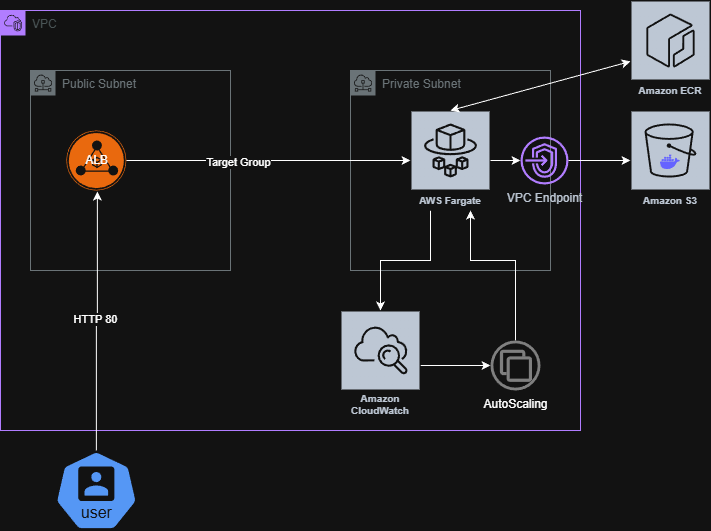

AWS ECS Fargate Infrastructure Repair

1. Error analysis:
- ECR Pull Error: ECS Tasks in the private network could not pull the container image.
- Error in ALB registration: Containers could not register with the Target Group - incorrect target type.
- No IAM permissions: The ECS agent did not have roles that allowed it to download images and send logs.
- No Autoscaling: No defined policy for autoscaling.

2. How to fix the errors?

Step 1: Restore connectivity to ECR

An S3 Gateway VPC Endpoint was added to the 06_networking.tf file so that ECS Tasks could download Docker image layers from ECR in a private subnet without having to go outside through the NAT Gateway. Instead of trying to go out to the internet, the image download request is routed directly through the AWS internal subnet to S3, which is cheaper, faster, and more secure.

Step 2: ALB

An ip Target Group has been added to the 11_alb.tf file because ECS Fargate has been set to network_mode = awsvpc, which requires tasks to be registered by IP address rather than instance ID. The “Instance” mode would have instructed ALB to search for an EC2 machine, but Fargate is a serverless service, and we are not using EC2 here. Traffic is directed directly to the container's IP.

Step 3: ECS Tasks

Increased  health_check_grace_period_seconds = 10->60. This gives NGINX time to start up.

Step 4: Autoscaling Fix

Added scale_out and scale_in policies and added CloudWatch alarms. Scale-out - when the threshold is exceeded, Auto Scaling automatically adds new Tasks, which prevents application overload during high traffic. Scale-in - when traffic decreases, the system reduces the number of tasks so you don't have to pay for unused resources. Thanks to alarms, the system reacts automatically.

